# Chicago Transit Alerts

A public archive of Chicago Transit Authority (CTA) and Metra service alerts and bot-detected disruptions, with a GitHub-style heatmap of incident frequency over the last 90 days. CTA covers the 'L' trains and buses; Metra covers the region's commuter-rail lines.

> **Unofficial project.** Not affiliated with, endorsed by, or sponsored by the Chicago Transit Authority or Metra.

**Live site:** https://chicagotransitalerts.app

<p align="center">
  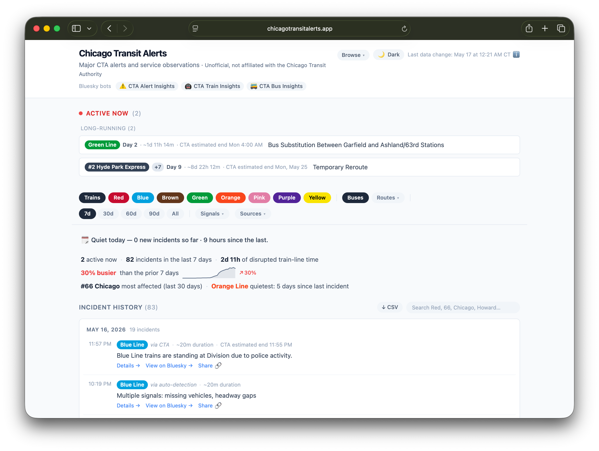
</p>

## What you see

- **Active alerts** — anything currently disrupting service, surfaced at the top of the page. The two most recent show as full cards; additional ongoing incidents collapse to compact one-line rows so a system-wide bad afternoon doesn't push the rest of the page off the screen. New incidents picked up by the 5-minute poll briefly fade-in so returning visitors notice what's changed.
- **At-a-glance summary** — three flowing groups: state + 7-day volume, a week-over-week trend phrase with an inline sparkline, and the most-affected line/route over 30 days plus the train line with the longest clean streak.
- **Agency filter** — an All / CTA / Metra toggle scopes the incident list to one agency. CTA's line and bus filters narrow CTA only; Metra has its own line filter, so the two agencies never crowd each other out.
- **90-day timeline** — a per-line contribution-style grid. CTA train rows + the top 5 most-affected bus routes + an aggregate "Other" row for the long tail, then a row per Metra line that had activity. Click a day cell to drill into that single day; click a line name to open its dedicated page.
- **When do incidents happen?** — a 7×24 hour-of-week heatmap so you can see whether things really are worse at PM rush or on Sunday mornings.
- **Signal mix by line** — stacked bars showing the proportion of bot detection types per line: gap, bunching, ghost, cold stretch, and trains-held for CTA; cancellations and delays for Metra (its own section). Bus and line pages also show a single-row variant scoped to that route.
- **Incident history** — chronological day-grouped list of every captured alert and observation. Filterable by CTA line, bus route, Metra line, agency, time window (7d / 30d / 90d / all), single pinned day, signal type, and free-text search across headlines, station names, route numbers, and route names ("Howard", "Aurora", "Red Line", "UP-N", "headway gaps", etc). Search matches are highlighted in the list as you type.
- **Per-line page** — `/line/:line` (CTA), `/metra/line/:line` (Metra), and `/route/:routeId` (bus) show reliability stats, year-over-year delta (when ≥1y of data exists), resolution-time histogram, and a per-station heatmap on a geographic line map (CTA trains + Metra lines).
- **Compare** — `/compare` puts up to three CTA train lines, bus routes, or Metra lines side-by-side with a stat table, overlaid duration histograms, signal-mix rows, and a row of mini hour-of-week heatmaps. State round-trips through the URL (`?trains=red,blue,green` / `?buses=66,X9,77` / `?metra=up-n,bnsf`).
- **Per-event detail page** — every captured incident gets a permalink at `/event/:id`. Alongside the timeline of CTA/bot updates it surfaces severity badges ("longest Blue Line incident in 30 days", "top 10% by duration"), a recurring-stretch callout ("this stretch has had N disruptions in 90 days"), a busy/quiet hour-of-day note, a live-ticking "ongoing for…" counter on active incidents, surrounding-24h context on the same line, ±1h cross-line context, a 14-day mini timeline whose day cells deep-link to that day (filtered to the line), prev/next navigation (same line and system-wide), and a "copy summary" button.

Filter state, the pinned day, and the search query all round-trip through the URL — any view is a shareable link.

## More views

A pulse on the last 24 hours, on top of the 90-day per-line timeline:

<p align="center">
  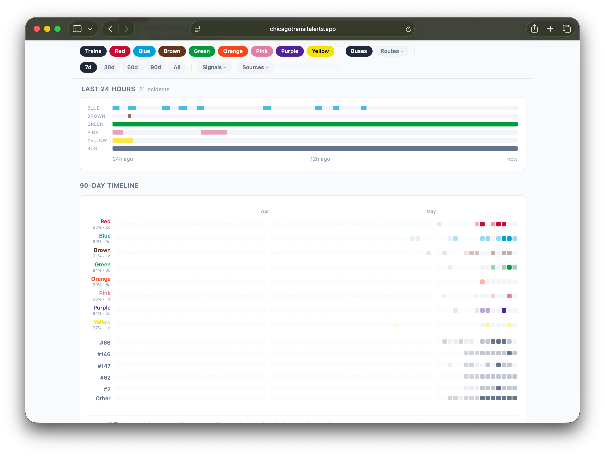
</p>

A 7×24 hour-of-week heatmap and the per-line breakdown of bot-detection signal types:

<p align="center">
  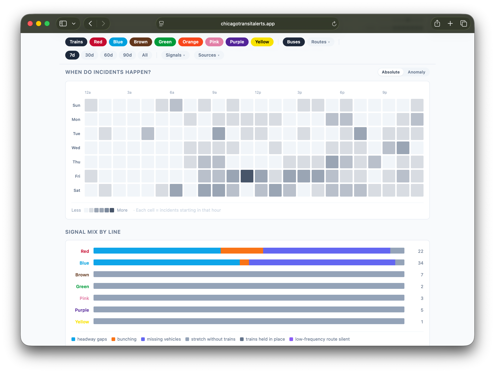
</p>

Every captured incident gets its own permalink with surrounding context, a 14-day mini timeline, and (for bot detections) the geographic footprint:

<p align="center">
  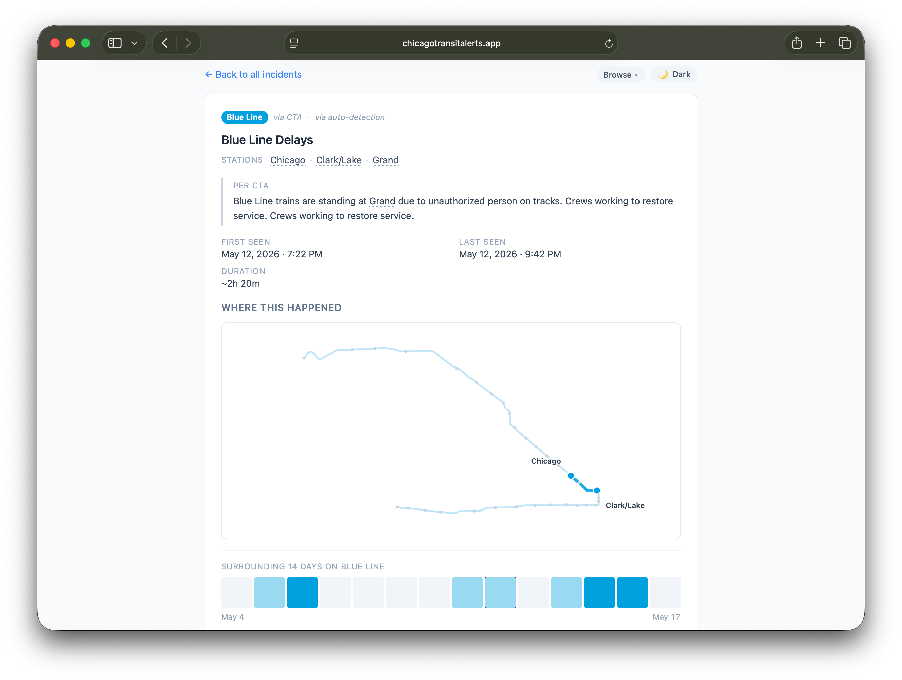
</p>

CTA train lines, bus routes, Metra lines, and individual stations each have a dedicated page with reliability stats, signal mix, and a per-station heatmap (CTA trains and Metra lines get a geographic line map):

<table align="center">
  <tr>
    <td width="33%">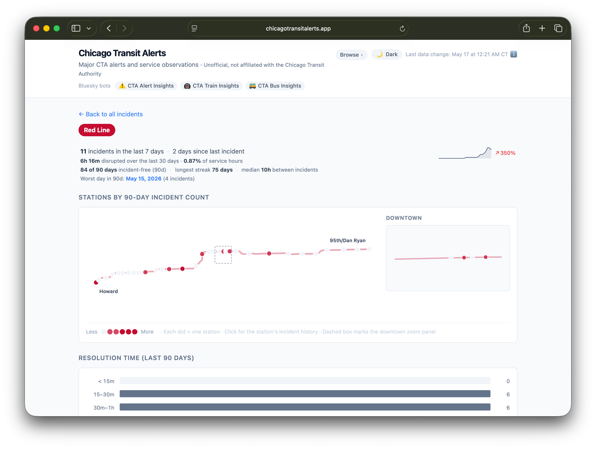<br><sub align="center">Train line · <code>/line/red</code></sub></td>
    <td width="33%">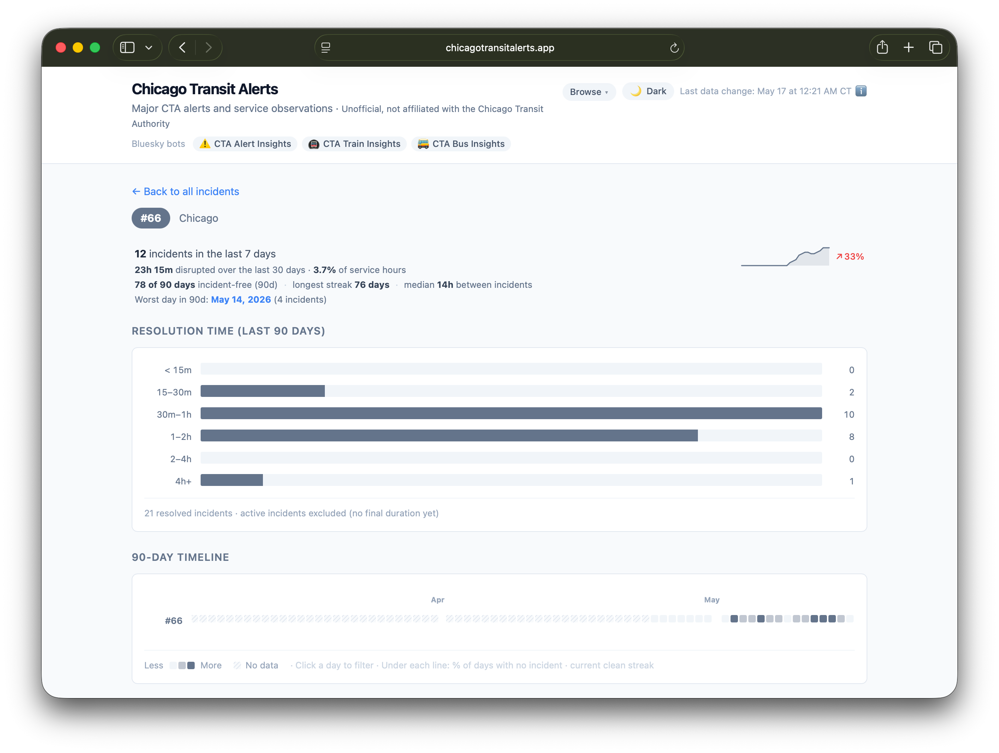<br><sub align="center">Bus route · <code>/route/66</code></sub></td>
    <td width="33%">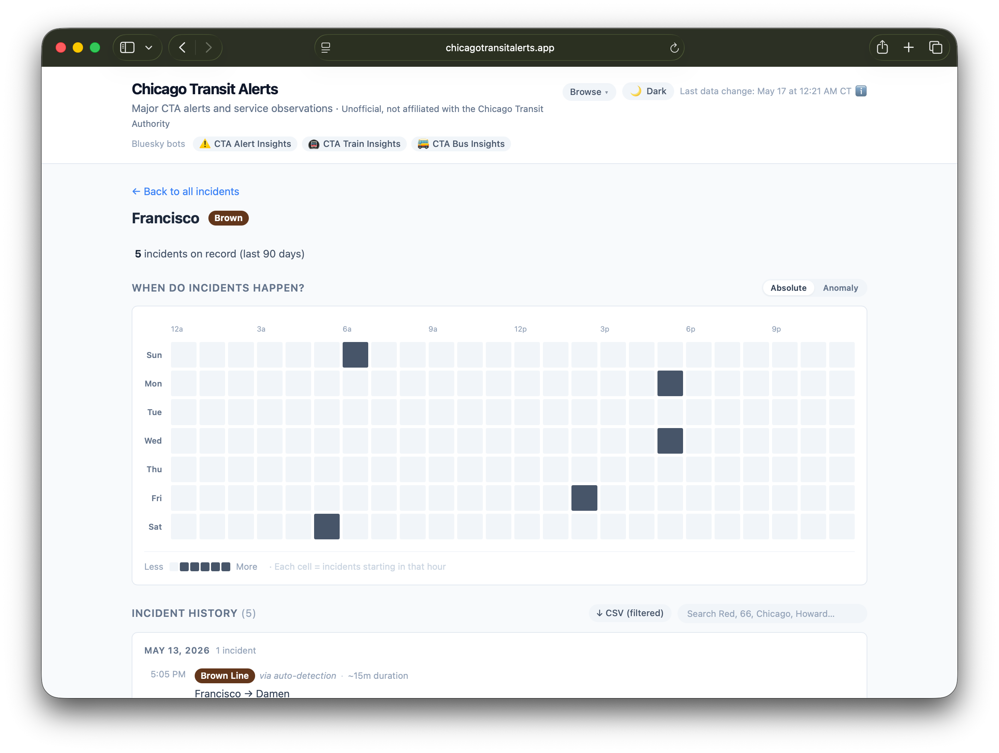<br><sub align="center">Station · <code>/station/francisco</code></sub></td>
  </tr>
</table>

Compare up to three lines or routes side-by-side:

<p align="center">
  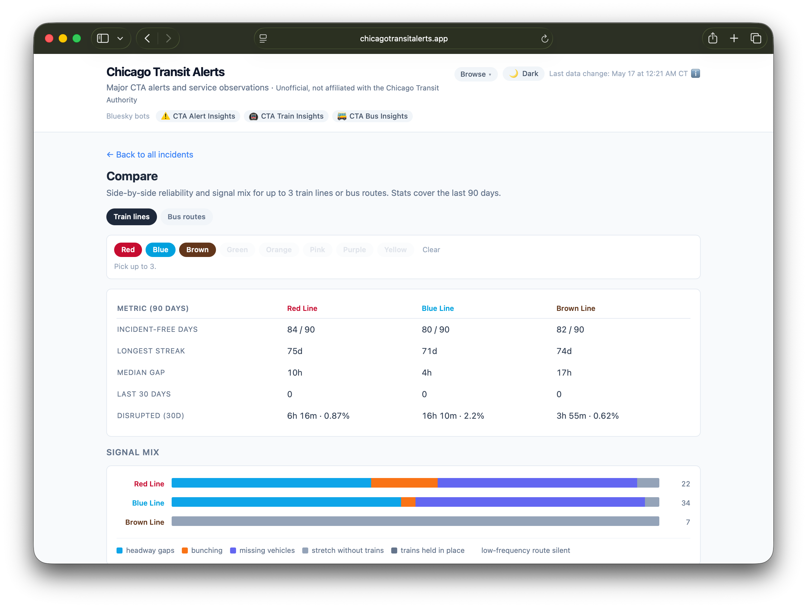
</p>

Metra commuter rail joins the timeline, stats, and compare views above, and has its own line pages (`/metra/line/up-n`), station pages (`/metra/station/aurora`), and a system-health dashboard (`/system/metra`) covering cancellations and delays.

A 12-month calendar heatmap, a stats page with worst-day / worst-station leaderboards, and per-mode system-health snapshots:

<table align="center">
  <tr>
    <td width="50%">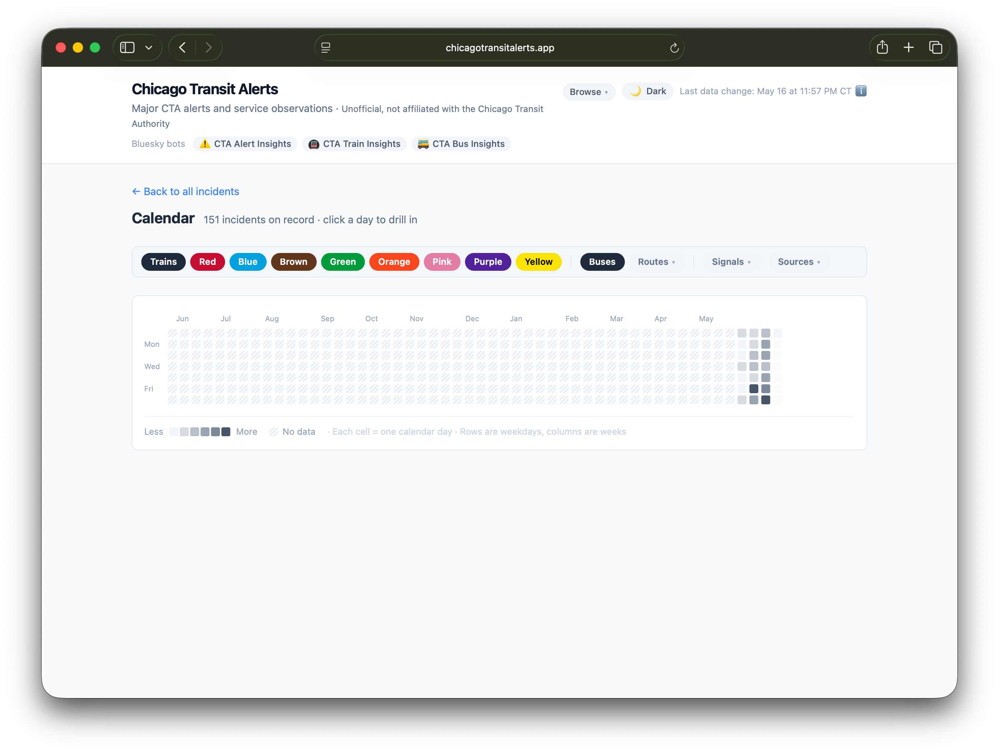<br><sub align="center">Calendar · <code>/calendar</code></sub></td>
    <td width="50%">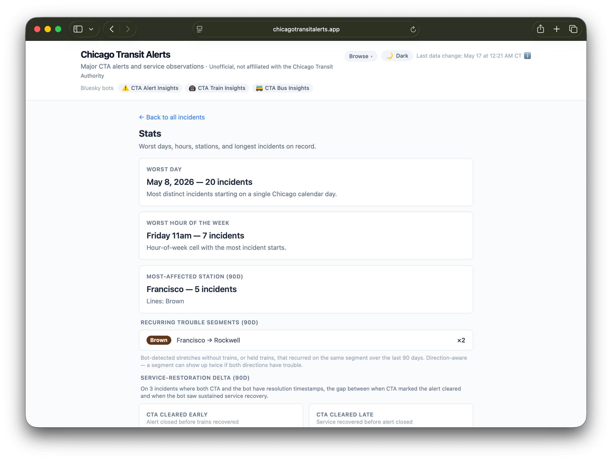<br><sub align="center">Stats · <code>/stats</code></sub></td>
  </tr>
  <tr>
    <td width="50%">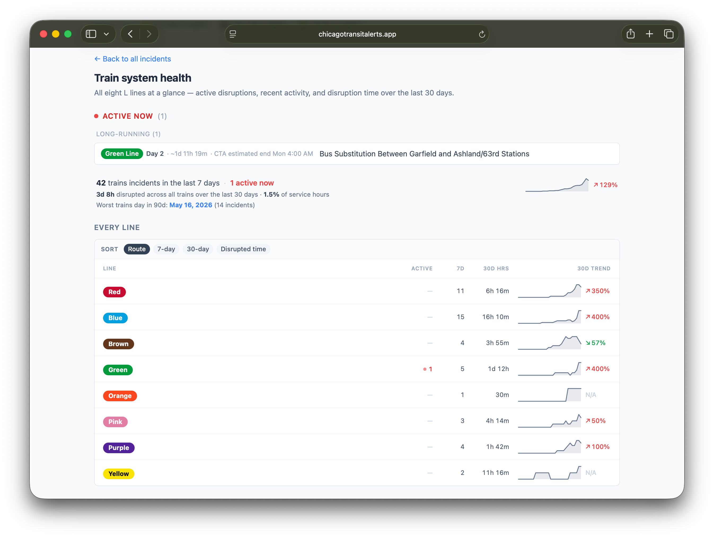<br><sub align="center">Trains · <code>/system/trains</code></sub></td>
    <td width="50%">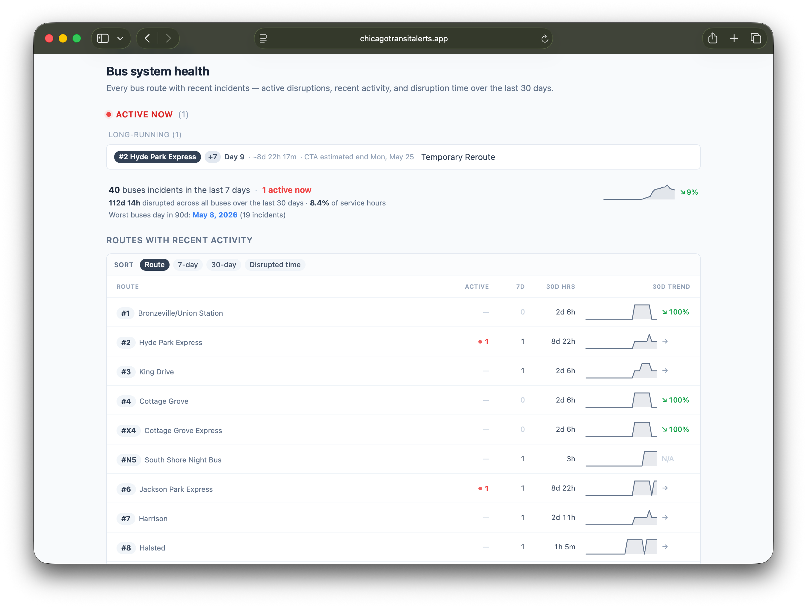<br><sub align="center">Buses · <code>/system/buses</code></sub></td>
  </tr>
</table>

And it works on mobile:

<p align="center">
  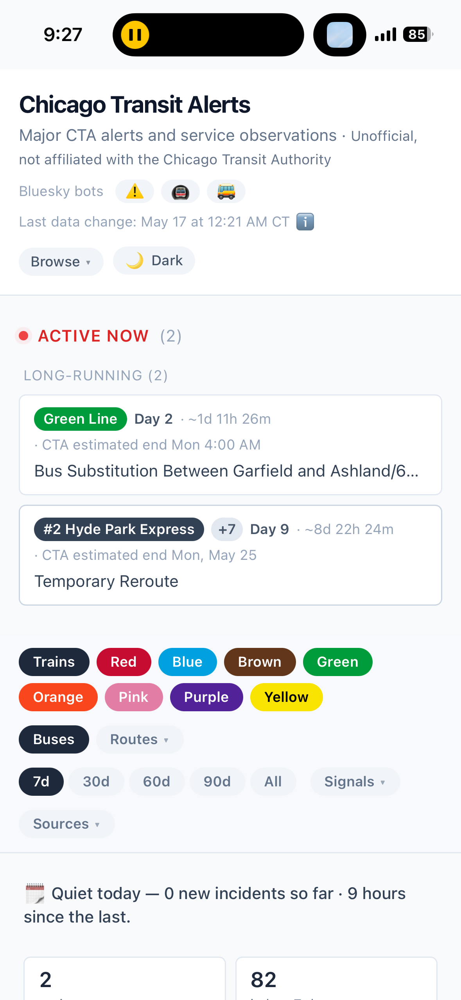
</p>

## Subscribe

An Atom feed of the 50 most recent incidents (alerts + bot observations, all lines and routes) lives at [`/feed.xml`](https://chicagotransitalerts.app/feed.xml). Drop the URL into any feed reader (Feedly, Inoreader, NetNewsWire, etc.) to follow along — new entries appear as incidents are detected, and resolved incidents bump their entry so readers re-mark them unread when service clears.

Each entry carries `<media:thumbnail>`, `<media:content>`, and a small HTML `<content type="html">` body so readers that support those (Inoreader, Feedly) display the per-event OG card as the entry icon and a richer preview pane than the one-line `<summary>`.

**Per-line and per-route feeds.** If you only care about one line or route, subscribe to its own feed instead of the firehose:

- Train line — `/feed/line/:line.xml` (e.g. [`/feed/line/red.xml`](https://chicagotransitalerts.app/feed/line/red.xml))
- Bus route — `/feed/route/:route.xml` (e.g. [`/feed/route/66.xml`](https://chicagotransitalerts.app/feed/route/66.xml))
- Metra line — `/feed/metra/line/:line.xml` (e.g. [`/feed/metra/line/up-n.xml`](https://chicagotransitalerts.app/feed/metra/line/up-n.xml)) — lowercase GTFS line code

A feed exists for every train line, **every** bus route, and **every** Metra line in the roster up front — not just ones with a prior incident — so you can subscribe to your route today and it simply stays quiet until something happens. Each line and route page links its feed (the “🔔 Subscribe (RSS)” control), and prerendered pages advertise it via `<link rel="alternate" type="application/atom+xml">` for reader autodiscovery. Every feed also has a JSON Feed twin at the same path with a `.json` extension.

The feeds are regenerated as a postbuild step from the same `alerts.json` the SPA reads, so they update whenever the underlying data does.

## What's tracked

Two agencies — CTA and Metra — each with official alerts and independent bot detections, displayed together.

### CTA (trains & buses)

- **Official CTA alerts** — significant service alerts published by the CTA, captured via the CTA Alerts API and republished by the [@ctaalertinsights.chicagotransitalerts.app](https://bsky.app/profile/ctaalertinsights.chicagotransitalerts.app) Bluesky bot.
- **Bot-detected observations** — service disruptions inferred from live train and bus positions:
  - **Cold stretch** — no service through a segment for 15+ min (or 2.5× scheduled headway).
  - **Trains held in place** — multiple trains visibly stationary in a 1-mile cluster for 10+ min, with no other train moving through. Single-train holds where GPS goes silent are also caught via an inferred-held path inside the cold detector.
  - **Headway gap** — gap between consecutive vehicles materially longer than the scheduled headway.
  - **Bunching** — clusters of vehicles arriving stacked.
  - **Missing vehicles ("ghost")** — full hour where fewer vehicles ran than the schedule implies.
  - **Multi-signal roundup** — when several of the above fire on the same line at once.
  Posted by [@ctatraininsights](https://bsky.app/profile/ctatraininsights.chicagotransitalerts.app) and [@ctabusinsights](https://bsky.app/profile/ctabusinsights.chicagotransitalerts.app).

### Metra (commuter rail)

Metra runs on a published timetable, so its detectors look different from the CTA's frequency-based ones:

- **Official Metra alerts** — GTFS-realtime service alerts published by Metra, republished by [@metraalertinsights.chicagotransitalerts.app](https://bsky.app/profile/metraalertinsights.chicagotransitalerts.app).
- **Cancellations** — a train is either Metra-confirmed cancelled, or **bot-inferred**: a scheduled train that never appears in the real-time feed long after its departure, with no covering alert. Inferred cancellations are suppressed when the whole feed goes quiet, so a data outage isn't mistaken for mass cancellations.
- **Delays** — a train running materially behind its scheduled arrival (currently 15+ minutes).

  Cancellations, delays, and speed maps are posted by [@metraalertinsights](https://bsky.app/profile/metraalertinsights.chicagotransitalerts.app) and [@metrainsights](https://bsky.app/profile/metrainsights.chicagotransitalerts.app).

When an official alert and a bot observation describe the same incident on the same line within a couple of hours, they're paired into a single incident rather than double-counted — within each agency (a CTA alert never pairs with a Metra observation). That pairing happens once, server-side in the [cta-insights](https://github.com/cailinpitt/cta-insights) pipeline, so the published data and the site both treat it as one event (see [Data as an API](#data-as-an-api) for the shape). Each bot-detected observation also carries a small evidence payload ("3 trains held · 22 min stationary", "the 6:30 PM Aurora train not seen running") shown as a chip on the incident — a one-line answer to "why does the bot think this happened?".

## Routes

Client-side routing only — every path renders the SPA from the same `index.html`. GitHub Pages's `404.html` (a copy of `index.html`) handles unknown paths so deep-links work without server-side rewriting.

| Path                    | What it shows                                                                          |
| ----------------------- | -------------------------------------------------------------------------------------- |
| `/`                     | Homepage with all the cards, filterable.                                               |
| `/event/:id`            | Single-incident detail page (id is the Bluesky post rkey).                             |
| `/line/:line`           | CTA train line page — `/line/red`, `/line/blue`, `/line/orange`, etc. CTA short codes (`org`, `p`, `g`, `brn`, `y`) also resolve correctly. |
| `/route/:routeId`       | Bus route page — `/route/66`, `/route/X9`, `/route/J14`, etc.                          |
| `/metra/line/:line`     | Metra line page — `/metra/line/up-n`, `/metra/line/bnsf`, etc. (lowercase GTFS route codes).      |
| `/station/:slug`        | CTA train station page — `/station/clark-division`, `/station/howard`, etc. Slugs are kebab-case derived from station names. Names with line qualifiers slug accordingly: `Central (Green)` → `/station/central-green`. |
| `/metra/station/:slug`  | Metra station page — `/metra/station/aurora`, `/metra/station/naperville`, etc. (kept in a separate namespace from CTA stations). |
| `/stations`             | A–Z directory of every CTA 'L' station and Metra station, each linking to its station page. |
| `/routes`               | Directory of every CTA train line, bus route, and Metra line, each linking to its page.  |
| `/system/:mode`         | Mode-wide health dashboard — `/system/trains`, `/system/buses`, `/system/metra`.        |
| `/calendar`             | 12-month calendar heatmap of daily incident counts. Click a day to drill into it.       |
| `/stats`                | Worst-day / worst-hour / worst-station / longest-incident leaderboards, plus year-over-year and a Metra cancellations/delays section. |
| `/compare`              | Side-by-side reliability, signal mix, and resolution-time comparison for up to 3 CTA train lines, bus routes, or Metra lines. State round-trips through `?trains=red,blue,green`, `?buses=66,X9,77`, or `?metra=up-n,bnsf`. |
| `/week`, `/week/:date`  | Sunday–Saturday recap of one week — counts, per-day breakdown, most-affected lines, longest incident, and a week-over-week delta. `/week` is the current week; `/week/<YYYY-MM-DD>` is the archived week containing that date (the canonical permalink uses the week's Sunday). |

## How it works

The site is a static React app — no backend, no database calls from the browser. All data lives in a single JSON file regenerated server-side and committed to this repo.

1. A cron job on a home server runs [`push-web-data.sh`](https://github.com/cailinpitt/cta-insights/blob/main/bin/push-web-data.sh) every 7 minutes.
2. The script exports the latest data from the [cta-insights](https://github.com/cailinpitt/cta-insights) SQLite database — pairing official CTA and Metra alerts with matching bot observations into unified incidents — to `public/data/alerts.json`, and commits if anything changed.
3. GitHub Actions builds the Vite app and deploys it to GitHub Pages.
4. The browser polls `alerts.json` every 5 minutes so the page stays current without a reload.

## Data as an API

The same JSON the SPA reads is published at a stable URL:

```
https://chicagotransitalerts.app/data/alerts.json
```

It's regenerated whenever the underlying data changes (typically every 7 minutes when there's activity) and served from GitHub Pages with no auth. Use it however you like — research, journalism, hobby dashboards, training data. Breaking changes to this shape are recorded in the [data changelog](https://chicagotransitalerts.app/data/CHANGELOG.md) ([source](public/data/CHANGELOG.md)) — check it before pinning to the format.

The top-level array is `incidents` — **one object per real-world disruption**. An official alert (CTA or Metra) and the bot observation(s) describing the same incident are paired server-side into a single object (no client-side merging needed): the `cta` block carries the official alert (null for bot-only incidents), and `observations[]` carries the bot detections (empty for CTA-only incidents). `sources` tells you which contributed. A non-exhaustive sketch:

```jsonc
{
  "generated_at": 1715200000000,        // epoch ms when the snapshot was produced
  "data_start_ts": 1707350400000,       // earliest moment we have coverage for
  "incidents": [
    {
      "id": "3k2j...",                  // stable permalink id (Bluesky post rkey); /event/:id
      "kind": "train",                  // "train", "bus", or "metra"
      "routes": ["red"],                // CTA line names ('red',…), bus route numbers, or Metra codes ('up-n')
      "first_seen_ts": 1715199000000,
      "resolved_ts": null,              // null = still open
      "active": true,
      "sources": ["cta", "bot"],        // which observers contributed: "cta", "bot", or both
      "cancellation": null,             // Metra single-train annulment (else null): { state:
                                        // 'upcoming'|'cancelled', scheduled_departure_ts,
                                        // scheduled_arrival_ts, train_number, origin }
      "cta": {                          // null for bot-only incidents
        "alert_id": "...",
        "headline": "...",
        "short_description": "...",     // CTA's own body text (reroute/closure details)
        "post_url": "https://bsky.app/profile/.../post/...",
        "resolved_reply_url": null,     // reply post when CTA cleared the alert
        "first_seen_ts": 1715199000000, // CTA's own lifecycle, distinct from the incident's
        "resolved_ts": null,
        "active": true,
        "affected_from_station": null,
        "affected_to_station": null,
        "affected_direction": null,
        "mentioned_stations": [],       // canonical station names parsed from the alert text
        "affected_stations": [],        // full segment fill (endpoints + inner stops) for a
                                        // "between X and Y" alert; [] when no segment resolves
        "cta_event_start_ts": null,     // CTA's claimed event window (date-only flags alongside)
        "cta_event_end_ts": null
        // "versions": [...]            // present only when CTA edited the alert text over time
      },
      "observations": [                 // [] for CTA-only incidents
        {
          "id": 12345,
          "detection_source": "pulse-cold", // CTA: 'gap','bunching','ghost','pulse-held','thin-gap','roundup'
                                            // Metra: 'cancellation','cancellation-inferred','delay'
          "signals": ["gap", "bunching"],   // populated for roundups
          "from_station": "Howard",
          "to_station": "Loyola",
          "stations": ["Howard", "Jarvis", "Morse", "Loyola"], // full stretch (endpoints + inner
                                        // stops), from_station → to_station; omitted when not enumerable
          "direction_label": "toward the Loop", // pre-rendered "toward <terminus>"; null when unavailable
          "ts": 1715199000000,          // when the bot posted; matches post_url
          "onset_ts": 1715197860000,    // disruption start, back-dated to the last observed train
                                        // (pulse-cold/thin-gap); null when not back-dated — use ts
          "resolved_ts": 1715202600000,
          "duration_ms": 4740000,       // resolved_ts - (onset_ts ?? ts); null while active
          "active": false,
          "post_url": "https://bsky.app/profile/.../post/...",
          "resolved_post_url": null,
          "bot_description": "…",       // pre-rendered plain-English summary
          "onset_description": "…",     // pre-rendered "the gap began here" sentence for the
                                        // onset timeline entry; omitted when there's no back-date
          "evidence": { /* … */ }       // small "why the bot fired" payload (CTA train/bus only;
                                        // omitted on Metra observations — see bot_description instead)
        }
      ]
    }
  ]
}
```

Field-by-field documentation lives as JSDoc in [`src/lib/incidents.js`](src/lib/incidents.js). An [Atom feed](https://chicagotransitalerts.app/feed.xml) is also published if you want notifications without polling — globally, or [per line/route](#subscribe) (e.g. `/feed/line/red.xml`, `/feed/route/66.xml`, `/feed/metra/line/up-n.xml`), each with a JSON Feed twin.

A flat CSV mirror is also published for spreadsheet and pandas users — the incidents are flattened back to **one row per alert or observation**, with an explicit `type` column:

```
https://chicagotransitalerts.app/data/alerts.csv
```

Columns: `type, id, kind, routes, headline, detection_source, signals, from_station, to_station, direction, direction_label, first_seen_ts, onset_ts, resolved_ts, duration_minutes, active, post_url, resolved_post_url`. Timestamps are ISO 8601 (UTC); `routes` (full line names) and `signals` are semicolon-separated when multi-valued. `onset_ts` is the disruption start for absence-style observations (back-dated from `first_seen_ts` to the last observed train) and is blank when not back-dated; `duration_minutes` is measured from `onset_ts` when present, else `first_seen_ts`. Regenerated alongside `alerts.json`.

> **Metra coverage note.** Metra incidents (`kind: "metra"`) are present in `alerts.json`, the flat **CSV**, the global **feed**, and their own **per-line Metra feeds** (`/feed/metra/line/:line.xml`), and are rendered across the site. Metra cancellations/delays are website-data-first (no individual Bluesky post), so their feed entries link to the on-site event page and carry no `post_url`. Metra line pages and event pages render a geographic line map (line shape + station heatmap, and per-event from→to segment highlighting), and Metra line, station, event, and system pages all get prerendered OG share cards (posted events only, same rule as CTA).

Please be a courteous client — cache responses, don't poll faster than every few minutes, and credit the project if you build something public.

## Stack

- [Vite](https://vitejs.dev/) + [React 19](https://react.dev/) + [Tailwind CSS](https://tailwindcss.com/)
- [Vitest](https://vitest.dev/) + [Testing Library](https://testing-library.com/) for tests, [Biome](https://biomejs.dev/) for linting and formatting
- Hosted on [GitHub Pages](https://pages.github.com/) with a custom domain
- Data pipeline lives in [cta-insights](https://github.com/cailinpitt/cta-insights) — see its README for how alerts and observations are produced.

## Development

```sh
npm install
npm run dev      # local dev server
npm test         # run the Vitest suite
npm run lint     # Biome check (lint + format)
npm run format   # Biome check --write (autofix)
npm run build    # production build into dist/
```

PRs to `main` must pass both the test and lint jobs (see [`.github/workflows/ci.yml`](.github/workflows/ci.yml)) before they can be merged.
