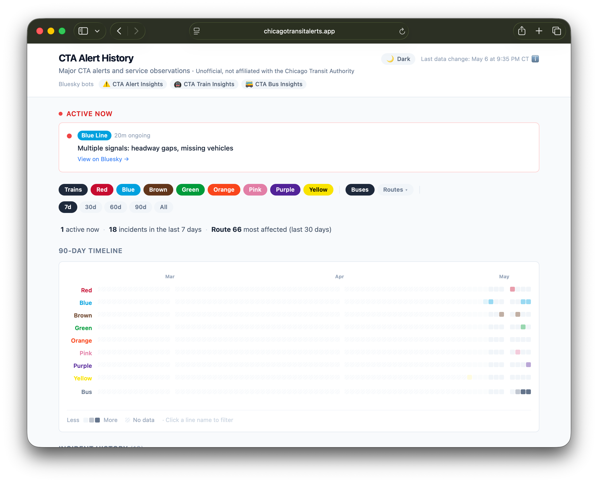
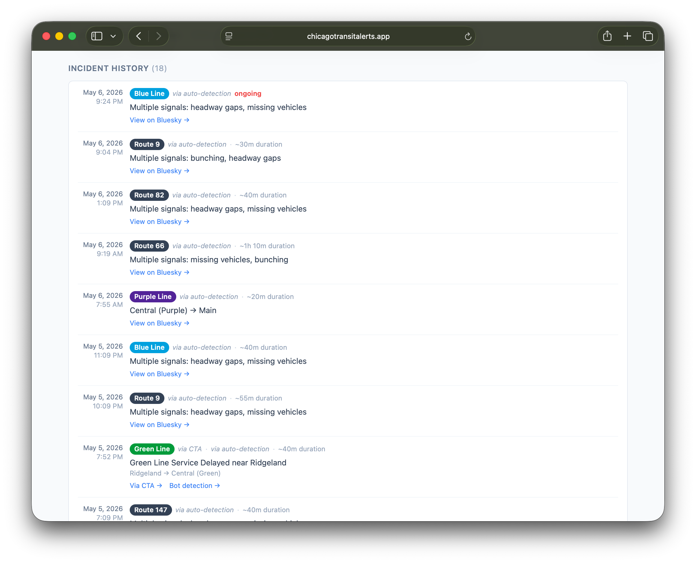

# CTA Alert History

A public archive of Chicago Transit Authority service alerts and bot-detected disruptions, with a GitHub-style heatmap of incident frequency over the last 90 days.

> **Unofficial project.** Not affiliated with, endorsed by, or sponsored by the Chicago Transit Authority.

**Live site:** https://chicagotransitalerts.app





## What you see

- **Active alerts** — anything currently disrupting service, surfaced at the top of the page. The two most recent show as full cards; additional ongoing incidents collapse to compact one-line rows so a system-wide bad afternoon doesn't push the rest of the page off the screen. New incidents picked up by the 5-minute poll briefly fade-in so returning visitors notice what's changed.
- **At-a-glance summary** — three flowing groups: state + 7-day volume, a week-over-week trend phrase with an inline sparkline, and the most-affected line/route over 30 days plus the train line with the longest clean streak.
- **90-day timeline** — a per-line contribution-style grid. Train rows + the top 5 most-affected bus routes + an aggregate "Other" row for the long tail. Click a day cell to drill into that single day; click a line name to open its dedicated page.
- **When do incidents happen?** — a 7×24 hour-of-week heatmap so you can see whether things really are worse at PM rush or on Sunday mornings.
- **Signal mix by line** — stacked bars showing the proportion of bot detection types (gap, bunching, ghost, cold stretch, trains held in place) per train line. Bus route pages also show a single-row variant scoped to that route.
- **Incident history** — chronological day-grouped list of every captured alert and observation. Filterable by line, bus route, time window (7d / 30d / 90d / all), single pinned day, signal type, and free-text search across headlines, station names, route numbers, and route names ("Howard", "Chicago", "Red Line", "headway gaps", etc). Search matches are highlighted in the list as you type.
- **Per-line page** — `/line/:line` and `/route/:routeId` show reliability stats, year-over-year delta (when ≥1y of data exists), resolution-time histogram, and a per-station heatmap on a stylized line map (trains).
- **Compare** — `/compare` puts up to three train lines or bus routes side-by-side with a stat table, overlaid duration histograms, signal-mix rows, and a row of mini hour-of-week heatmaps. State round-trips through the URL (`?trains=red,blue,green` / `?buses=66,X9,77`).
- **Per-event detail page** — every captured incident gets a permalink at `/event/:id` with surrounding-24h context on the same line and a 14-day mini timeline.

Filter state, the pinned day, and the search query all round-trip through the URL — any view is a shareable link.

## Subscribe

An Atom feed of the 50 most recent incidents (alerts + bot observations, all lines and routes) lives at [`/feed.xml`](https://chicagotransitalerts.app/feed.xml). Drop the URL into any feed reader (Feedly, Inoreader, NetNewsWire, etc.) to follow along — new entries appear as incidents are detected, and resolved incidents bump their entry so readers re-mark them unread when service clears.

Each entry carries `<media:thumbnail>`, `<media:content>`, and a small HTML `<content type="html">` body so readers that support those (Inoreader, Feedly) display the per-event OG card as the entry icon and a richer preview pane than the one-line `<summary>`.

The feed is regenerated as a postbuild step from the same `alerts.json` the SPA reads, so it updates whenever the underlying data does.

## What's tracked

Two distinct sources, displayed together:

- **Official CTA alerts** — significant service alerts published by the CTA, captured via the CTA Alerts API and republished by the [@ctaalertinsights.bsky.social](https://bsky.app/profile/ctaalertinsights.bsky.social) Bluesky bot.
- **Bot-detected observations** — service disruptions inferred from live train and bus positions:
  - **Cold stretch** — no service through a segment for 15+ min (or 2.5× scheduled headway).
  - **Trains held in place** — multiple trains visibly stationary in a 1-mile cluster for 10+ min, with no other train moving through. Single-train holds where GPS goes silent are also caught via an inferred-held path inside the cold detector.
  - **Headway gap** — gap between consecutive vehicles materially longer than the scheduled headway.
  - **Bunching** — clusters of vehicles arriving stacked.
  - **Missing vehicles ("ghost")** — full hour where fewer vehicles ran than the schedule implies.
  - **Multi-signal roundup** — when several of the above fire on the same line at once.
  Posted by [@ctatraininsights](https://bsky.app/profile/ctatraininsights.bsky.social) and [@ctabusinsights](https://bsky.app/profile/ctabusinsights.bsky.social).

When an official alert and a bot observation describe the same incident on the same line within a couple of hours, they're merged into a single entry rather than double-counted. Each bot-detected observation also carries a small evidence payload ("3 trains held · 22 min stationary", "2 stations cold · 3 trains missed") shown as a chip on the incident — a one-line answer to "why does the bot think this happened?".

## Routes

Client-side routing only — every path renders the SPA from the same `index.html`. GitHub Pages's `404.html` (a copy of `index.html`) handles unknown paths so deep-links work without server-side rewriting.

| Path                    | What it shows                                                                          |
| ----------------------- | -------------------------------------------------------------------------------------- |
| `/`                     | Homepage with all the cards, filterable.                                               |
| `/event/:id`            | Single-incident detail page (id is the Bluesky post rkey).                             |
| `/line/:line`           | Train line page — `/line/red`, `/line/blue`, `/line/orange`, etc. CTA short codes (`org`, `p`, `g`, `brn`, `y`) also resolve correctly. |
| `/route/:routeId`       | Bus route page — `/route/66`, `/route/X9`, `/route/J14`, etc.                          |
| `/station/:slug`        | Train station page — `/station/clark-division`, `/station/howard`, etc. Slugs are kebab-case derived from station names. Names with line qualifiers slug accordingly: `Central (Green)` → `/station/central-green`. |
| `/calendar`             | 12-month calendar heatmap of daily incident counts. Click a day to drill into it.       |
| `/stats`                | Worst-day / worst-hour / worst-station / longest-incident leaderboards plus year-over-year. |
| `/compare`              | Side-by-side reliability, signal mix, and resolution-time comparison for up to 3 train lines or bus routes. State round-trips through `?trains=red,blue,green` or `?buses=66,X9,77`. |

## How it works

The site is a static React app — no backend, no database calls from the browser. All data lives in a single JSON file regenerated server-side and committed to this repo.

1. A cron job on a home server runs [`push-web-data.sh`](https://github.com/cailinpitt/cta-insights/blob/main/bin/push-web-data.sh) every 7 minutes.
2. The script exports the latest alert and observation data from the [cta-insights](https://github.com/cailinpitt/cta-insights) SQLite database to `public/data/alerts.json` and commits if anything changed.
3. GitHub Actions builds the Vite app and deploys it to GitHub Pages.
4. The browser polls `alerts.json` every 5 minutes so the page stays current without a reload.

## Data as an API

The same JSON the SPA reads is published at a stable URL:

```
https://chicagotransitalerts.app/data/alerts.json
```

It's regenerated whenever the underlying data changes (typically every 7 minutes when there's activity) and served from GitHub Pages with no auth. Use it however you like — research, journalism, hobby dashboards, training data. A non-exhaustive sketch of the shape:

```jsonc
{
  "generated_at": 1715200000000,         // epoch ms when the snapshot was produced
  "data_start_ts": 1707350400000,        // earliest moment we have coverage for
  "alerts": [
    {
      "alert_id": "...",
      "kind": "train",                   // or "bus"
      "routes": ["red"],                 // line keys ('red', 'g', 'org', …) or bus route numbers
      "headline": "...",
      "first_seen_ts": 1715199000000,
      "resolved_ts": null,               // null = still open
      "active": true,
      "post_url": "https://bsky.app/profile/.../post/...",
      "affected_from_station": null,
      "affected_to_station": null
    }
  ],
  "observations": [
    {
      "id": 12345,
      "kind": "train",
      "line": "red",
      "ts": 1715199000000,
      "resolved_ts": 1715202600000,
      "active": false,
      "detection_source": "pulse-cold",  // or 'gap', 'bunching', 'ghost', 'pulse-held', 'roundup'
      "signals": ["gap", "bunching"],    // populated for roundups
      "from_station": "Howard",
      "to_station": "Loyola",
      "post_url": "https://bsky.app/profile/.../post/..."
    }
  ]
}
```

Field-by-field documentation lives as JSDoc in [`src/lib/incidents.js`](src/lib/incidents.js). An [Atom feed](https://chicagotransitalerts.app/feed.xml) is also published if you want notifications without polling.

A flat CSV mirror of the same data — one row per alert or observation, with an explicit `type` column — is also published for spreadsheet and pandas users:

```
https://chicagotransitalerts.app/data/alerts.csv
```

Columns: `type, id, kind, routes, headline, detection_source, signals, from_station, to_station, direction, first_seen_ts, resolved_ts, duration_minutes, active, post_url, resolved_post_url`. Timestamps are ISO 8601 (UTC); `routes` and `signals` are semicolon-separated when multi-valued. Regenerated alongside `alerts.json`.

Please be a courteous client — cache responses, don't poll faster than every few minutes, and credit the project if you build something public.

## Stack

- [Vite](https://vitejs.dev/) + [React 19](https://react.dev/) + [Tailwind CSS](https://tailwindcss.com/)
- [Vitest](https://vitest.dev/) + [Testing Library](https://testing-library.com/) for tests, [Biome](https://biomejs.dev/) for linting and formatting
- Hosted on [GitHub Pages](https://pages.github.com/) with a custom domain
- Data pipeline lives in [cta-insights](https://github.com/cailinpitt/cta-insights) — see its README for how alerts and observations are produced.

## Development

```sh
npm install
npm run dev      # local dev server
npm test         # run the Vitest suite
npm run lint     # Biome check (lint + format)
npm run format   # Biome check --write (autofix)
npm run build    # production build into dist/
```

PRs to `main` must pass both the test and lint jobs (see [`.github/workflows/ci.yml`](.github/workflows/ci.yml)) before they can be merged.
